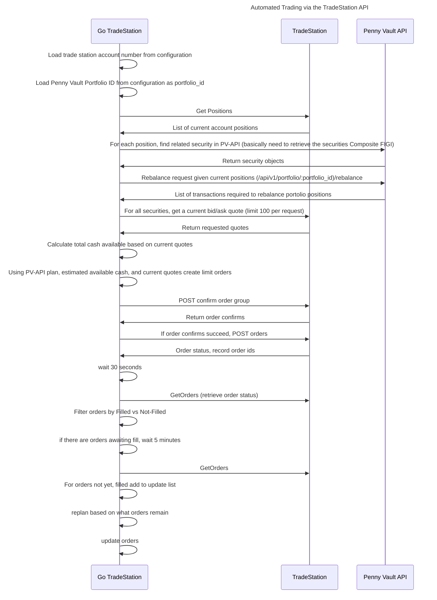

# pv-tradestation

pv-tradestation acts as a bridge between pvapi and the TradeStation brokerage.
It enables users to automatically execute a pvapi trading strategy within their
brokerage.

# Install

```bash
mage build
```

# Configuration

Configuration parameters should be placed in a file called `tradestation.toml`

| Field Name          | Req | Description                                                                                          |
|---------------------|-----|------------------------------------------------------------------------------------------------------|
| sim                 | Yes | URL to tradestation simulated trading environment (https://sim-api.tradestation.com/v3)              |
| live                | Yes | URL to tradestation live trading environment (https://api.tradestation.com/v3)                       |
| mode                | Yes | Indicates whether the simulated or live api's should be used. Value should be either 'sim' or 'live' |
| state_file          | Yes | File to save API state in (note: file is AES encrypted with SSH key)                                 |
| auth.offline_access | Yes | Enable refresh_tokens, this allows you to use the trade station API as an unattended daemon          |
| auth.apikey         | Yes | API Key issued by tradestation                                                                       |
| auth.secret         | Yes | API Secret issued by tradestation                                                                    |
| pv.apikey           | No  | API Token for access to PV-API. Required if syncing with a PV-API strategy                           |
| key_file            | No  | Path to encryption key (defaults to ~/.ssh/id_rsa)                                                   |

# Managing automatic strategy investment with PV-API

The primary purpose of this tool is to enable automatic investment of PV-API guided strategies within TradeStation.
There are many moving parts to manage when automatically executing a strategy because prices are changing in real-time.
This makes it difficult to predict how many shares should be purchased of an individual security because the price is a
moving target. To address this pv-tradestation uses an iterative approach where it makes a purchase proposal at a
specific price. If that proposal is not accepted within 5 minutes it replans and makes another proposal. This process
is repeated until all securities have been successfully purchased.


